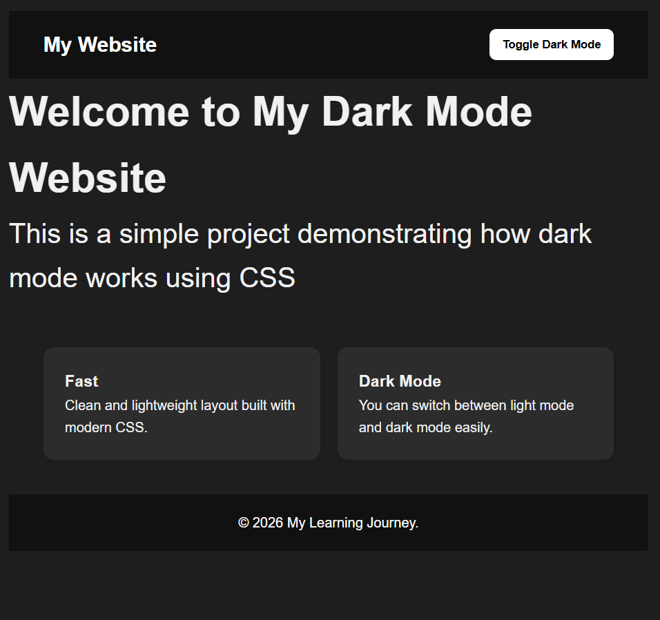

# 🌙 Dark Mode Responsive Website

A simple and modern **Dark Mode website** built using **HTML and CSS**.
This project demonstrates how to create a clean UI with automatic dark mode support and responsive design.

---

## 📸 Project Preview



---

## 🚀 Features

* 🌙 Automatic Dark Mode (based on system settings)
* 📱 Fully Responsive Design
* 🎨 Clean and Modern UI
* ⚡ Lightweight and fast
* 🧩 Built with pure HTML & CSS (no frameworks)

---

## 🛠 Technologies Used

* HTML5
* CSS3
* CSS Grid
* Media Queries
* Modern CSS (`prefers-color-scheme`)

---

## 🌙 Dark Mode Implementation

This project uses modern CSS to detect the user's system theme:

```css
@media (prefers-color-scheme: dark) {
  /* Dark styles */
}
```

When the user's device is set to **dark mode**, the website automatically adapts.

---

## 📱 Responsive Design

The layout adjusts to different screen sizes:

| Device  | Layout    |
| ------- | --------- |
| Desktop | 3 columns |
| Tablet  | 2 columns |
| Mobile  | 1 column  |

---

## 🎯 Learning Purpose

This project is part of my **web development learning journey**.

I am currently learning **HTML and CSS** and building projects to strengthen my skills.

I am trying to learn **as quickly and as solidly as possible**, but sometimes my **health slows me down a little**.
Even so, I continue practicing step by step and improving every day.

---

## 📂 How to Use

1. Clone the repository
2. Open `tecnologies.html` in your browser
3. Enable dark mode on your device to see the effect

---

## ⭐ Project Status

✔ Completed as a practice project
✔ Ready for GitHub portfolio

---

💡 More projects coming soon as I continue improving my frontend development skills.
